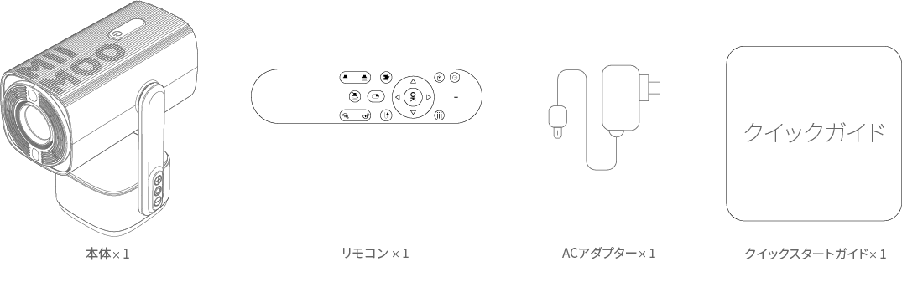
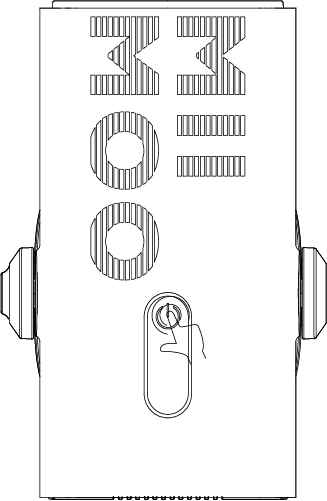

# MIIMOO STAND S1 ユーザー説明書

<figure markdown>
  
  <figcaption>MIIMOO Stand S1</figcaption>
</figure>

### MIIMOO Stand S1
### モデル：CM-2024

製造元：株式会社MIIMOO  
2024年12月

## 安全上のご注意

!!! warning "ご注意"
    ご使用の前に、この取扱説明書をよくお読みください。説明書に記載されていない設定や変更はしないでください。取扱説明書に従わなかった場合による物理的な損傷、データの損失、その他の損害については保証の対象外となります。

### 設置について

1. 火災・感電防止のため、雨や湿気にさらさないでください。花瓶などの液体の入った物を本機の上に置かないでください。
2. じゅうたんやテーブルクロスなど柔らかい面の上に置かないでください。
3. 過度の埃やほこりの多い場所、強い磁場を発生する機器の近くには設置しないでください。
4. 通風孔をふさがないでください。
5. 密閉された空間には設置せず、適切な換気のため周囲に十分なスペースを確保してください。
6. 直射日光、熱源を避け、温度変化の大きい場所での使用は避けてください。動作・保管温度：0°F～95°F（約-17.8℃～35℃）

### 操作について

!!! note "使用上の注意"
    1. 長時間使用すると本体が熱くなることがあります。その場合は直ちに電源を切り、電源プラグを抜いて、本体の温度が下がってから再度ご使用ください。
    2. 本機を丁寧に取り扱ってください。レンズに触れないでください。お子様が使用する場合は、必ず大人の監督のもとで行ってください。
    3. 本機の上に重いものや鋭利な物を置かないでください。

### 電源について

!!! danger "電源に関する警告"
    1. 電源ケーブルを過度に曲げないでください。損傷した電源ケーブルは感電の原因となります。
    2. 本機に表示された電源電圧以外では使用しないでください。
    3. メーカー指定の付属品・アクセサリー以外は使用しないでください。

### その他の注意事項

!!! tip "推奨事項"
    1. 過度の振動は内部部品を損傷する可能性がありますので避けてください。
    2. お客様自身で分解しないでください。保証が無効になります。
    3. 最適な投写結果を得るため、暗い部屋でご使用ください。
    4. 長期間使用しない場合は、電源を切り、電源プラグをコンセントから抜いてください。

## パッケージ内容

<figure markdown>
  
</figure>

=== "同梱物"
    - 本体（メインユニット）　1台
    - リモコン　1個
    - ACアダプター　1個
    - セットアップガイド　1枚

=== "注意事項"
    - 開封時に内容物をご確認ください。
    - 不足・破損時は販売店へご連絡ください。
    - 梱包材は保管してください。

=== "取付について"
    - 1/4インチネジ規格対応
    - カメラ三脚・プロジェクター三脚両対応

## 接続端子について

<figure markdown>
  
</figure>

### 本体接続端子

| 番号 | 名称 | 用途 |
|:---:|:---|:---|
| ① | DC入力端子 | 付属ACアダプターのみ使用可 |
| ② | HDMI端子 | デジタル映像・音声入力 |
| ③ | AV端子 | アナログ映像・音声入力 |
| ④ | USB Type-A端子 | USB機器接続用 |
| ⑤ | 赤外線受光部 | リモコン信号受信用 |
| ⑥ | RGBステータスインジケーター | 状態表示用 |

!!! info "接続時の注意"
    - 電源オフ時に接続してください。
    - コネクター向きを確認してください。

## 操作ボタン説明

<figure markdown>
  
</figure>

### ボタン配置

1. **プロジェクター電源ボタン**
    * プロジェクターのオン/オフ操作用
2. **アンビエントライトモード/音量アップボタン**
    * ライトモード切替・音量調整用
3. **アンビエントライト電源/ミュートボタン**
    * ライトオン/オフ・音声ミュート用
4. **アンビエントライトカラー/音量ダウンボタン**
    * ライト色切替・音量調整用
5. **LEDアンビエントライト**
    * 間接照明用

!!! note "操作注意点"
    * タッチ感度が高いため軽く触れてください。
    * 詳細機能は各モード設定参照。

## 基本的な使い方

### 初期設定手順

#### 1. 注意ラベルの確認

<figure markdown>
  
</figure>

本製品には注意ラベル①および注意ラベル②が添付されています。これらのラベルには製品を安全にご使用いただくための重要な情報が記載されています。

#### 2. 電源の接続

<figure markdown>
  
</figure>

!!! warning "電源接続時の注意"
    付属のACアダプターを本体のACアダプタージャックに接続します。必ず付属のACアダプターをご使用ください。付属品以外のACアダプターを使用すると、故障や事故の原因となる恐れがあります。

#### 3. 電源のオン/オフ

<figure markdown>
  
</figure>

電源ボタンに2秒間触れ続けると、オン/オフの切り替えができます。

#### 4. 初回起動について

<figure markdown>
  初期起動画面

</figure>

<figure markdown>
  言語選択
</figure>

<figure markdown>
  网络设置
</figure>

<!-- <figure markdown>
  
</figure> -->

初めて電源を入れると、初期設定モードに入ります。画面の指示に従って各種設定を行ってください。

#### 5. 投影角度の調整について

<!-- 

-   ２３５度回転

-   

 -->

<figure markdown>
  ２３５度回転
</figure>
<figure markdown>
  自動台形補正
</figure>

!!! tip "投影のコツ"
    プロジェクターは自由な角度で設置が可能です。自動台形補正・オートフォーカス機能により、鮮明な映像を自動的に調整します。

    * 投影距離は1.2m～2mの範囲で設置してください。
    * 適切な投影距離を確保することで、より鮮明な映像をお楽しみいただけます。

### 画質調整

- オート四隅補正使用
- フォーカスボタンで微調整
- オートフォーカス有効化推奨

---

!!! question "お問い合わせ"
    ご不明な点がございましたら、カスタマーサポートまでお問い合わせください。